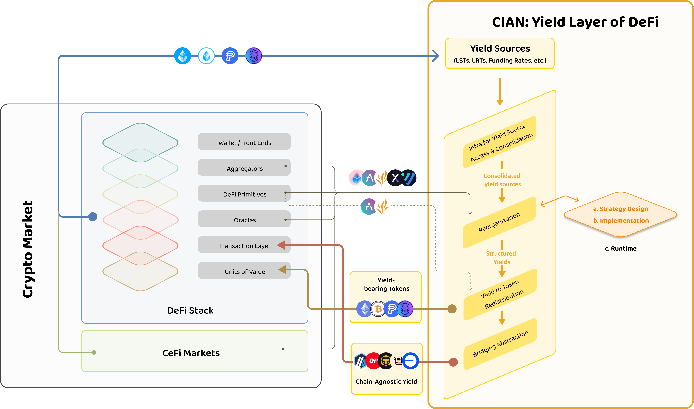
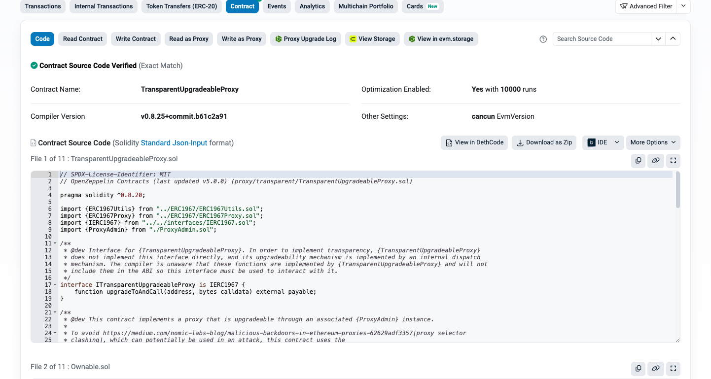
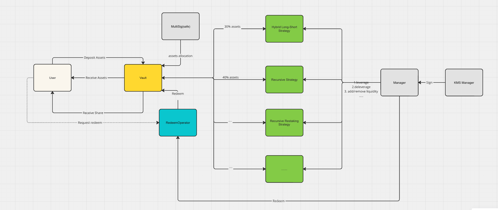

# **CIAN Yield Layer Technical Documentation Overview**

# **Introduction**

## **Purpose**

The purpose of this document is to provide comprehensive technical information about the CIAN Yield Layer smart contracts. It details the structure, strategies, and operational mechanics that underpin CIAN's Yield Layer.

## **Scope**

This documentation covers the architecture and mechanisms of the CIAN Yield Layer smart contract, including its components, functionalities, and interaction with other DeFi primitives. It delves into detailed insights into the technical implementation and security features.

## **Audience**

This document is intended for CIAN's business partners, tech-savvy users, and developers who are interested in the intricacies of smart contracts and their applications within the CIAN Yield Layer. It also targets system architects and IT professionals involved in the implementation and maintenance of blockchain-based solutions.

# **Overview**

## **What is the CIAN Yield Layer?**

The Yield Layer is a virtual layer that consolidates secure, scalable, and sustainable yield sources across the entire crypto space, reorganizes them into structured yields, and redistributes the yields to a multitude of tokens and networks. The objectives are:

1. to boost the sustainable growth of decentralized projects with the organic yield sources from the entire crypto space;
2. to provide users with the optimized yields through the dynamic (re)distribution of assets into a vector of cutting edge yield sources and yield strategies.




Within CIAN’s yield layer framework, the infrastructure provides transparent, flexible, and secure asset management with best-in-class APY for retail stETH/LRT holders. Yield Layer represents an advanced evolution in the decentralized finance (DeFi) ecosystem.

## **Key Features**

1. ### **Security:**

    - **Multi-Signature for Fund Allocation and Parameter Adjustments**: Changes of fund distribution and parameters requires multiple approvals, safeguarding the decision-making process and smart contract’s security.
    - **Complete Contract Implementation for Strategies**: Employs full contract implementations for strategies instead of signature filters, enhancing both security and transparency.
    - **Exchange Rate Limitations**: Enforces strict internal limits on exchange rates to protect funds during transactions.

2. ### **Transparency:**

    - **On-Chain Viewable Strategy Contracts**: Strategy contracts are fully viewable on the blockchain, ensuring transparent fund flows. [Link to yield layer vault open sources smart contracts.](https://etherscan.io/address/0xB13aa2d0345b0439b064f26B82D8dCf3f508775d)  
      
    - **On-Chain Asset Calculation**: Asset calculations are performed on-chain, ensuring transparency of strategy position.
    - **Multi-Signature and Time-Locked Fund Allocation**: Fund allocation parameters are made transparent through multi-signature and time-lock mechanisms.
    - **On-Chain Withdrawal Operations**: Withdrawal operations are executed on-chain, ensuring transparent fund withdrawals.

3. ### **Flexibility:**

    - **Contract-Based Strategy Limitations**: Allows strategy restrictions through contracts without the need for additional audits of strategy executors, ensuring efficient and flexible strategy execution, such as interactions with CEX custodial accounts.
    - **Unified Interface for Strategy Integration**: Implements a unified interface that facilitates easy integration of new strategies, maintaining flexibility in strategy deployment.

4. ### **Efficiency:**

    - **Accelerated Strategy Execution**: Contract limitations allow for safe and accelerated signature and on-chain operations, improving fund utilization and reducing position risk.
    - **Batch Withdrawal Operations**: Enhances withdrawal efficiency and reduces gas consumption through batch processing.
    - **Internal Parameter Calculations**: Parameters are calculated internally by the contract rather than being passed in, increasing transaction success rates and reducing operational costs.

# **Architecture**



Users deposit their assets into the Vault contract. In return for their deposits, users receive corresponding LP tokens. These tokens represent their share of the assets held in the Vault and entitle them to a proportionate share of the returns generated by the strategies.

The allocation ratios for strategy funds within the Vault contract are set using a multi-signature wallet. This multi-signature mechanism ensures that fund allocation decisions are secure, transparent, and require consensus from multiple parties.

Based on the strategy fund allocation ratios set in the Vault contract, assets from the Vault are transferred to the corresponding strategy contracts. These strategy contracts then perform various asset operations such as leveraging/de-leveraging, adding liquidity, and other strategy-specific actions to optimize returns. Each strategy operates according to its predefined rules and objectives, aiming to maximize the value of the assets allocated to it.

## **Component Description**

### **Vault Contract**

The **Vault contract** primarily receives user assets and issues LP tokens. It acts as the central repository for user deposits, ensuring that the assets are securely held and appropriately allocated to various strategies.

#### MultiSig

**Function and Responsibilities:**

The MultiSig module is designed to enhance security and transparency within the system. It requires multiple signatures to approve significant actions (e.g. adjusting asset allocation parameters), ensuring that no single entity can control the assets without consensus.

**Interactions and Dependencies:**

-   Adjusts the strategy fund allocation parameters within the Vault.
-   Executes fund transfers between the Vault and various strategies.

#### RedeemOperator

**Function and Responsibilities:**

The RedeemOperator module is mainly used to record user withdrawal request data and handle the withdrawal operations. It ensures that user withdrawal requests are processed efficiently and accurately.

**Interactions and Dependencies:**

-   Handles batch confirmations of multiple user withdrawal requests.
-   Completes each withdrawal operation in a single transaction.

**Code Example:**

```solidity
address thisUser_;
uint256 thisUserGet_;
for (uint256 i = 0; i < _users.length; ++i) {
   thisUser_ = _users[i];
   thisUserGet_ = _withdrawalRequest[thisUser_].mulDiv(assetPerShare_, PRECISION, Math.Rounding.Floor);
   // If the user's share is not enough to cover the gas, it will fail.
   IERC20(_token).safeTransfer(thisUser_, thisUserGet_ - _gasPerUser);
   _pendingWithdrawers.remove(thisUser_);
   delete _withdrawalRequest[thisUser_];
}
```

#### Net Asset

**Function and Responsibilities:**

The Net Asset module is responsible for calculating and providing the current net asset value (NAV) of the fund. It retrieves and aggregates the value of all assets held within the fund.

**Interactions and Dependencies:**

-   Interacts with various asset tracking components to get the latest values.
-   Aggregates the data to provide the total net asset value.

**Code Example:**

```solidity
function totalAssets() public view override returns (uint256) {
    if (block.timestamp - vaultState.lastUpdatePriceTime > vaultParams.maxPriceUpdatePeriod) {
        revert Errors.PriceNotUpdated();
    }
    return vaultState.exchangePrice * totalSupply() / PRECISION;
}
```

#### Unified ABI Interface

**Function and Responsibilities:**

The Unified ABI Interface ensures that all strategies implemented adhere to a standard interface, allowing seamless integration with the vault without compromising the integrity of the original contracts.

**Interactions and Dependencies:**

-   Facilitates the integration of new strategies into the vault.
-   Ensures backward compatibility with existing contracts.

**Code Example:**

```solidity
interface IStrategy {

function getNetAssets() external returns (uint256);

function onTransferIn(address token, uint256 amount) external returns (bool);

}
```

### **Strategy Contracts**

Various **strategy contracts** receive assets allocated from the Vault. These contracts perform specific asset operations, such as investing, trading, or lending, based on the defined strategies to generate returns for the users.

#### Position Protection

**Function and Responsibilities:**

The Position Protection module is designed to safeguard the positions based on the Loan-to-Value (LTV) ratios of the borrowed assets on platforms like Aave. It sets a protection threshold lower than the LTV to prevent liquidation risks.

**Interactions and Dependencies:**

-   Monitors the LTV ratios of borrowed assets.
-   Sets a protection line below the LTV ratio to trigger protective actions if breached.

**Code Example:**

```solidity
uint256 public constant MAX_PROTOCOL_RATIO = 0.85e18;
```

#### **Exchange Rate Safeguard**

**Function and Responsibilities:**

The Exchange Rate Safeguard module ensures the safety and profitability of funds during the position-building process by setting the worst acceptable exchange rate for swaps. If the rate exceeds this threshold, the transaction is reverted to protect the funds.

**Interactions and Dependencies:**

-   Monitors and sets the worst acceptable exchange rates for trading pairs.
-   Reverts transactions if the exchange rate is worse than the specified threshold.

**Code Example:**

```solidity
if (spentAmount_ > desc_.amount) revert Errors.OneInchUnexpectedSpentAmount();
if (returnAmount_ < _swapGetMin) revert Errors.OneInchUnexpectedReturnAmount();
```

### **Manager Module**

**Function and Responsibilities:**

The Manager module ensures the security of assets by using multiCall to batch execute operations like position adjustments and user withdrawals. This approach maintains atomicity, ensuring that either all operations succeed or none do, thereby protecting the integrity of the system.

**Interactions and Dependencies:**

-   Executes batch operations securely.
-   Ensures atomicity in operations to maintain system integrity.

**Code Example:**

```solidity
function multiCall(address[] calldata _addresses, bytes[] calldata _callBytes) external onlyOperator {
   if (_callBytes.length != _addresses.length || _addresses.length == 0) revert Errors.InvalidLength();

   for (uint256 i = 0; i < _callBytes.length; ++i) {
      Address.functionCall(_addresses[i], _callBytes[i]);
   }
}
```
